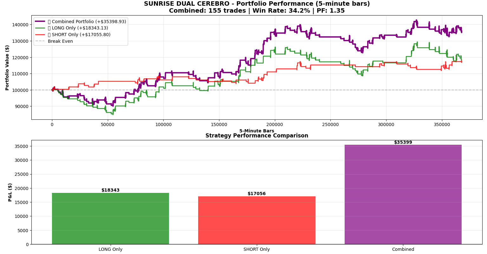
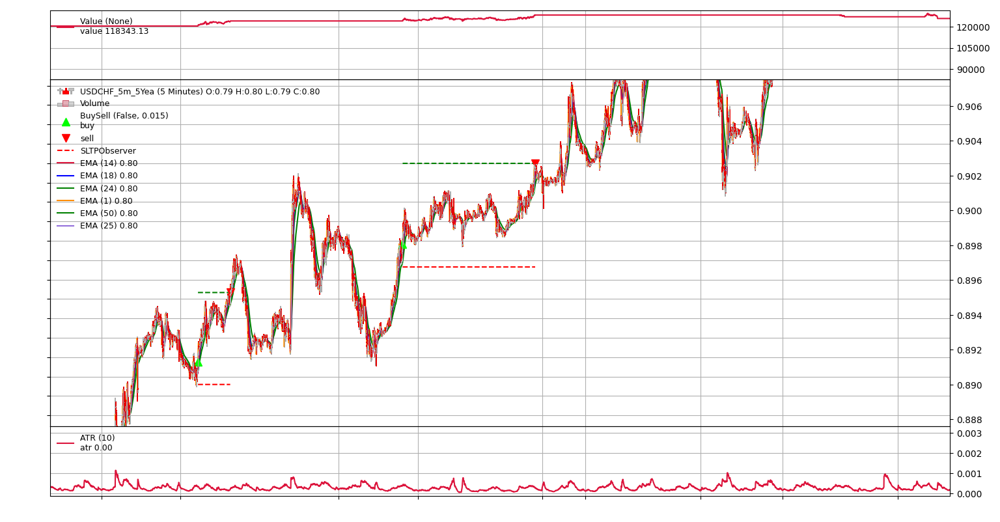

# Backtrader ATR Stop-Loss Strategy for USDCHF

[](https://opensource.org/licenses/MIT)
[](https://www.python.org/downloads/)
[](https://www.backtrader.com/)
[](.)

This repository presents a complete and profitable algorithmic trading strategy for the **USDCHF** currency pair on a **5-minute timeframe**. The system is implemented in Python using the `Backtrader` framework and features an advanced, dynamic risk management system based on the Average True Range (ATR).

The strategy was backtested over 5 years of historical data, achieving a **1.35 Profit Factor** with a **35.4% return** on initial capital.

---

## 📊 Performance Analysis

The core of this project's backtesting methodology is the "Dual Cerebro" approach, where LONG and SHORT strategies are run as two independent portfolios. This prevents conflicting signals and allows each directional bias to be optimized and evaluated on its own merits. The final "Combined" performance is the aggregation of these two independent results.

### Portfolio Performance (5-Year Backtest)



*   **Purple Line (Combined Portfolio):** Represents the total equity curve, showing a final P&L of **+$35,399**.
*   **Green Line (LONG Only Portfolio):** Shows the performance if only buy signals were traded, resulting in a P&L of **+$18,343**.
*   **Red Line (SHORT Only Portfolio):** Shows the performance if only sell signals were traded, resulting in a P&L of **+$17,056**.

This chart demonstrates that both the LONG and SHORT logic contribute positively and consistently to the overall profitability of the system.

---

## ✨ Key Features

-   📈 **Advanced Pullback Entry System**: The strategy does not enter on the initial signal. It waits for a confirmation pullback and enters on a breakout, significantly improving the entry quality and risk/reward ratio.
-   **🛡️ Dynamic ATR Risk Management**: Stop Loss and Take Profit levels are not fixed. They are calculated dynamically for *every trade* based on the market's current volatility (ATR), adapting the risk profile to live conditions.
-   **📐 EMA Angle Momentum Filter**: A unique filter that measures the slope of the confirmation EMA. It ensures trades are only taken during periods of strong, decisive market momentum, filtering out flat or choppy markets.
-   **🔄 Dual Cerebro Backtesting**: By testing LONG and SHORT logic independently, the strategy avoids signal interference and provides a clearer picture of each component's performance.
-   **🕰️ Time-of-Day Filtering**: Trading is restricted to the most liquid market hours (07:00 - 17:00 UTC) to focus on the highest probability setups.
-   **💰 Risk-Based Position Sizing**: Automatically calculates trade size to risk a fixed 1% of the account on every position, maintaining consistent risk exposure.

---

## 🧠 Strategy Logic & Visualization

The strategy is a multi-layered, trend-following system. An entry is only triggered when a sequence of conditions are met.

### How It Works: The 3-Phase Entry

1.  **Signal Detection**: A fast EMA (1) crosses over a basket of slower EMAs (14, 18, 24).
2.  **Pullback Wait**: The system waits for a small, controlled move against the trend (e.g., 1-2 red candles for a LONG signal).
3.  **Breakout Entry**: A market order is triggered only if the price breaks the high/low of the pullback, confirming the trend's continuation.

### Example of a LONG Trade



This chart shows the strategy in action:
-   **Candlestick Chart**: The 5-minute price action for USDCHF.
-   **EMA Lines**: The multiple EMAs used for signal generation.
-   **Green Triangle (Buy Signal)**: Marks the exact bar where a LONG trade was executed.
-   **Dashed Lines (SL/TP Observer)**: These are the most important feature. The **dashed red line** is the initial Stop Loss, and the **dashed green line** is the Take Profit target. Both are calculated using ATR multiples at the moment of entry.

---

## 📂 Code Overview

For a detailed view of the complete repository structure and file descriptions, see: **[Repository Structure Guide](../backtrader-pullback-window-usdchf/REPOSITORY_STRUCTURE.md)**

The entire logic is contained within `src/strategy/sunrise_osiris.py`. Here is a brief guide to its structure:

-   **Global Configuration (Lines 1-150):** This top section contains all user-editable parameters, such as date ranges, starting cash, ATR thresholds, and filter settings. This makes tuning the strategy easy without touching the core logic.
-   **`SunriseOsiris` Class `params` (Lines 153-270):** The official `Backtrader` parameters dictionary. These are the values that can be optimized during a parameter sweep.
-   **`__init__(self)` (Lines 605-700):** The strategy constructor where all indicators (EMAs, ATR) and state variables (e.g., for the pullback machine) are initialized.
-   **`next(self)` (Lines 875-1045):** The heart of the strategy. This method is called for every bar of data. It contains the main logic for checking entry/exit conditions and managing the trade lifecycle.
-   **Pullback State Machine (`_handle_pullback_entry`)**: A set of helper functions that manage the 3-phase entry logic (Signal -> Wait -> Breakout).
-   **Risk Management (`_calculate_forex_position_size`)**: A function dedicated to calculating the correct position size based on the stop-loss distance and the 1% account risk rule.
-   **Order Notifications (`notify_order`, `notify_trade`)**: These methods handle the feedback from the broker (simulated or real), placing the OCA (One-Cancels-All) Stop Loss and Take Profit orders after an entry is confirmed.

---

## 🚀 Getting Started

Follow these instructions to set up and run the backtest on your local machine.

### Prerequisites
-   Python 3.8 or newer.
-   Git version control.

### 1. Clone the Repository
Open your terminal and clone the repository:
```bash
git clone https://github.com/[Your-Username]/backtrader-atr-stop-loss-usdchf.git
cd backtrader-atr-stop-loss-usdchf
```

### 2. Set Up a Virtual Environment
It is highly recommended to use a virtual environment to manage dependencies.
```bash
# Create the virtual environment
python -m venv venv

# Activate it
# On Windows:
venv\Scripts\activate
# On macOS/Linux:
source venv/bin/activate
```

### 3. Install Requirements
Install the necessary Python libraries using the provided `requirements.txt` file.
```bash
pip install -r requirements.txt
```

### 4. Add Market Data
Place your 5-minute USDCHF data file into the `/data` directory. The project expects the file to be named `USDCHF_5m_5Yea.csv`.

### 5. Run the Backtest
Execute the strategy script from the root directory of the project.
```bash
python src/strategy/sunrise_osiris.py
```
The script will run the full Dual Cerebro backtest, print the performance summary to the console, generate detailed trade reports in the `/temp_reports` folder, and display the final performance chart.

---

## 🤝 Contributing

Contributions are welcome! Whether you want to report a bug, suggest an enhancement, or add a new feature, please feel free to do so.

-   **Report a Bug:** Open an [Issue](https://github.com/[Your-Username]/backtrader-atr-stop-loss-usdchf/issues) and describe the problem in detail.
-   **Suggest an Enhancement:** Open an [Issue](https://github.com/[Your-Username]/backtrader-atr-stop-loss-usdchf/issues) to discuss your idea.
-   **Submit a Pull Request:** Fork the repository, make your changes, and submit a [Pull Request](https://github.com/[Your-Username]/backtrader-atr-stop-loss-usdchf/pulls) with a clear description of your work.

---

## 📜 License

This project is licensed under the MIT License. See the [LICENSE](LICENSE) file for details.

---

## ⚠️ Disclaimer

This project is for educational and research purposes ONLY. It is not financial advice. Algorithmic trading involves substantial risk of loss and is not suitable for every investor. Past performance is not indicative of future results.